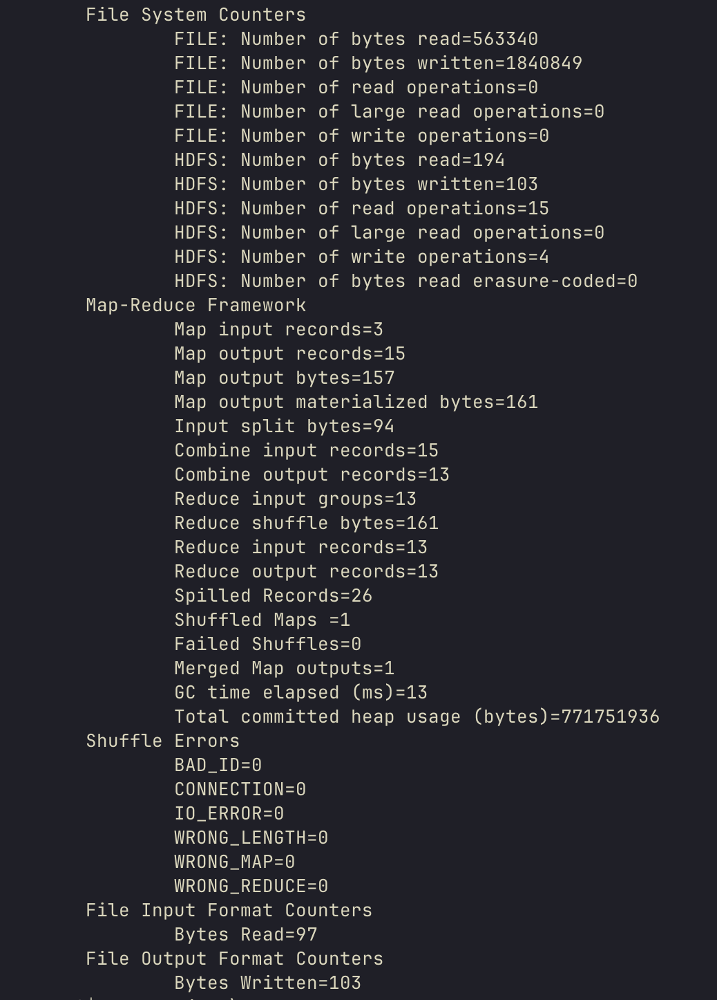

# Шаги выполнения

1. Создание контейнеров и подключение к контейнеру

``` bash
docker compose up -d
```

``` bash
docker exec -it client /bin/bash
```

2. Создайте директорию на HDFS /createme

``` bash
hdfs dfs -fs hdfs://master:8020 -mkdir -p /createme
```

3. Удалите директорию на HDFS /delme

``` bash
hdfs dfs -fs hdfs://master:8020 -rm -r -f /delme
```

4. Создайте файл на HDFS /nonnull.txt с произвольным содержимым

``` bash
echo "Some random content" | hdfs dfs -fs hdfs://master:8020 -put -f - /nonnull.txt
```

5. Выполните джобу MR wordcount через YARN для файла /shadow.txt

``` bash
cat <<EOF | hdfs dfs -fs hdfs://master:8020 -put -f - /shadow.txt
Innsmouth was once a quiet town.
Innsmouth hides many secrets.
The name Innsmouth appears again.
EOF
```

``` bash
hadoop jar \
  /opt/hadoop/share/hadoop/mapreduce/hadoop-mapreduce-examples-3.3.6.jar \
  wordcount \
  hdfs://master:8020/shadow.txt \
  hdfs://master:8020/wc_out
```



6. Запишите число вхождений слова "Innsmouth" в файл /whataboutinsmouth.txt

``` bash
innsmouth_count=$(hdfs dfs -fs hdfs://master:8020 -cat /wc_out/* | grep -i 'Innsmouth' | awk '{sum += $2} END {print sum+0}')
```

``` bash
echo ${innsmouth_count} | hdfs dfs -put - /whataboutinsmouth.txt
```

