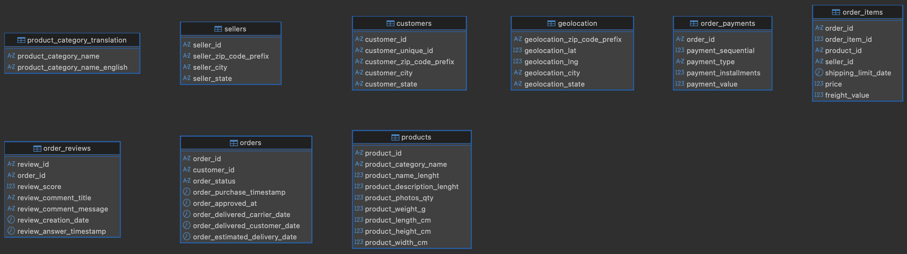
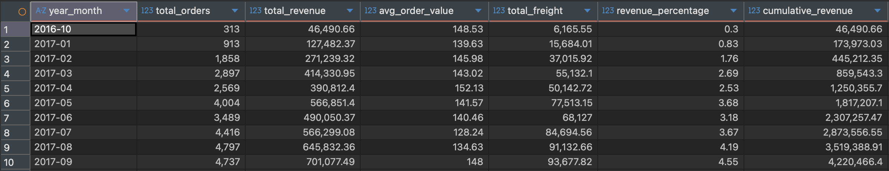
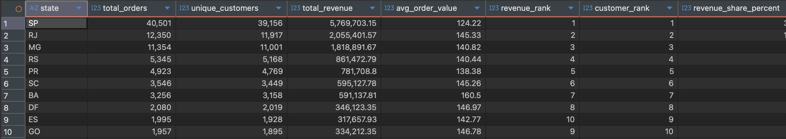
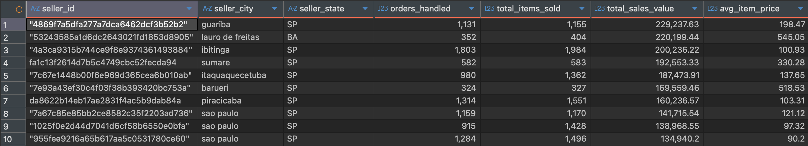
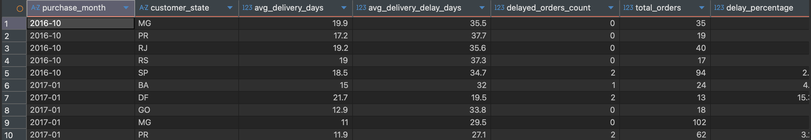
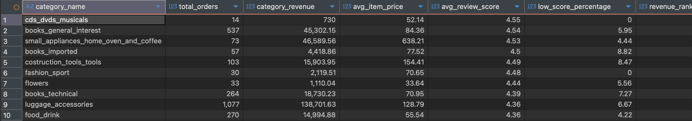

# Описание

В качестве данных был взят общедоступный [набор данных](https://www.kaggle.com/datasets/olistbr/brazilian-ecommerce/data) о заказах, сделанных в бразильском интернет-магазине Olist Store. Набор данных содержит информацию о 100 тысячах заказов, сделанных с 2016 по 2018 год на нескольких торговых площадках Бразилии. 

# Шаги выполнения

1. Развертка контейнера Hive:

``` bash
docker run -d -p 10000:10000 -p 10002:10002 --env SERVICE_NAME=hiveserver2 --name hive4 apache/hive:4.2.0
```

2. Копирование датасета в контейнер
3. Подключение к Hive через DBeaver
4. Создание базы данных

``` sql
CREATE DATABASE IF NOT EXISTS brazilian_ecommerce;
USE brazilian_ecommerce;
```

5. Создание таблиц

``` sql
-- Создаем таблицу с геолокацией
CREATE TABLE geolocation (
    geolocation_zip_code_prefix STRING,
    geolocation_lat DOUBLE,
    geolocation_lng DOUBLE,
    geolocation_city STRING,
    geolocation_state STRING
) ROW FORMAT DELIMITED
FIELDS TERMINATED BY ','
STORED AS TEXTFILE
TBLPROPERTIES ('skip.header.line.count'='1');

-- Создаем таблицу клиентов
CREATE TABLE customers (
    customer_id STRING,
    customer_unique_id STRING,
    customer_zip_code_prefix STRING,
    customer_city STRING,
    customer_state STRING
) ROW FORMAT DELIMITED
FIELDS TERMINATED BY ','
STORED AS TEXTFILE
TBLPROPERTIES ('skip.header.line.count'='1');

-- Создаем таблицу продавцов
CREATE TABLE sellers (
    seller_id STRING,
    seller_zip_code_prefix STRING,
    seller_city STRING,
    seller_state STRING
) ROW FORMAT DELIMITED
FIELDS TERMINATED BY ','
STORED AS TEXTFILE
TBLPROPERTIES ('skip.header.line.count'='1');

-- Создаем таблицу товаров
CREATE TABLE products (
    product_id STRING,
    product_category_name STRING,
    product_name_lenght INT,
    product_description_lenght INT,
    product_photos_qty INT,
    product_weight_g INT,
    product_length_cm INT,
    product_height_cm INT,
    product_width_cm INT
) ROW FORMAT DELIMITED
FIELDS TERMINATED BY ','
STORED AS TEXTFILE
TBLPROPERTIES ('skip.header.line.count'='1');

-- Создаем таблицу переводов категорий товаров
CREATE TABLE product_category_translation (
    product_category_name STRING,
    product_category_name_english STRING
) ROW FORMAT DELIMITED
FIELDS TERMINATED BY ','
STORED AS TEXTFILE
TBLPROPERTIES ('skip.header.line.count'='1');

-- Создаем таблицу заказов
CREATE TABLE orders (
    order_id STRING,
    customer_id STRING,
    order_status STRING,
    order_purchase_timestamp TIMESTAMP,
    order_approved_at TIMESTAMP,
    order_delivered_carrier_date TIMESTAMP,
    order_delivered_customer_date TIMESTAMP,
    order_estimated_delivery_date TIMESTAMP
) ROW FORMAT DELIMITED
FIELDS TERMINATED BY ','
STORED AS TEXTFILE
TBLPROPERTIES ('skip.header.line.count'='1');

-- Создаем таблицу элементов заказа
CREATE TABLE order_items (
    order_id STRING,
    order_item_id INT,
    product_id STRING,
    seller_id STRING,
    shipping_limit_date TIMESTAMP,
    price DECIMAL(10,2),
    freight_value DECIMAL(10,2)
) ROW FORMAT DELIMITED
FIELDS TERMINATED BY ','
STORED AS TEXTFILE
TBLPROPERTIES ('skip.header.line.count'='1');

-- Создаем таблицу платежей
CREATE TABLE order_payments (
    order_id STRING,
    payment_sequential INT,
    payment_type STRING,
    payment_installments INT,
    payment_value DECIMAL(10,2)
) ROW FORMAT DELIMITED
FIELDS TERMINATED BY ','
STORED AS TEXTFILE
TBLPROPERTIES ('skip.header.line.count'='1');

-- Создаем таблицу отзывов
CREATE TABLE order_reviews (
    review_id STRING,
    order_id STRING,
    review_score INT,
    review_comment_title STRING,
    review_comment_message STRING,
    review_creation_date TIMESTAMP,
    review_answer_timestamp TIMESTAMP
) ROW FORMAT DELIMITED
FIELDS TERMINATED BY ','
STORED AS TEXTFILE
TBLPROPERTIES ('skip.header.line.count'='1');
```

6. Загружаем базу данных

``` sql
LOAD DATA INPATH '/opt/hive/data/olist/olist_geolocation_dataset.csv' INTO TABLE geolocation;
LOAD DATA INPATH '/opt/hive/data/olist/olist_customers_dataset.csv' INTO TABLE customers;
LOAD DATA INPATH '/opt/hive/data/olist/olist_sellers_dataset.csv' INTO TABLE sellers;
LOAD DATA INPATH '/opt/hive/data/olist/olist_products_dataset.csv' INTO TABLE products;
LOAD DATA INPATH '/opt/hive/data/olist/product_category_name_translation.csv' INTO TABLE product_category_translation;
LOAD DATA INPATH '/opt/hive/data/olist/olist_orders_dataset.csv' INTO TABLE orders;
LOAD DATA INPATH '/opt/hive/data/olist/olist_order_items_dataset.csv' INTO TABLE order_items;
LOAD DATA INPATH '/opt/hive/data/olist/olist_order_payments_dataset.csv' INTO TABLE order_payments;
LOAD DATA INPATH '/opt/hive/data/olist/olist_order_reviews_dataset.csv' INTO TABLE order_reviews;
```

7. Проверяем корректную загрузку данных

``` sql
SELECT 'geolocation', COUNT(*) as row_count FROM geolocation;
SELECT * FROM geolocation LIMIT 5;
SELECT 'customers',  COUNT(*) FROM customers;
SELECT * FROM customers LIMIT 5;
SELECT 'sellers', COUNT(*) FROM sellers;
SELECT * FROM sellers LIMIT 5;
SELECT 'products', COUNT(*) FROM products;
SELECT * FROM products LIMIT 5;
SELECT 'product_category_translation', COUNT(*) FROM product_category_translation;
SELECT * FROM product_category_translation LIMIT 5;
SELECT 'orders', COUNT(*) FROM orders;
SELECT * FROM orders LIMIT 5;
SELECT 'order_items', COUNT(*) FROM order_items;
SELECT * FROM order_items LIMIT 5;
SELECT 'order_payments', COUNT(*) FROM order_payments;
SELECT * FROM order_payments LIMIT 5;
SELECT 'order_reviews', COUNT(*) FROM order_reviews;
SELECT * FROM order_reviews LIMIT 5;
```



8. Создаем витрину анализа ежемесячной динамики продаж и доходов

``` sql
CREATE VIEW sales_monthly_analysis AS
WITH monthly_agg AS (
    SELECT 
        DATE_FORMAT(o.order_purchase_timestamp, 'yyyy-MM') AS year_month,
        COUNT(o.order_id) AS total_orders,
        SUM(oi.price + oi.freight_value) AS total_revenue_raw,
        SUM(oi.freight_value) AS total_freight_raw
    FROM orders o
    JOIN order_items oi ON o.order_id = oi.order_id
    WHERE o.order_status = 'delivered'
        AND o.order_purchase_timestamp IS NOT NULL
    GROUP BY DATE_FORMAT(o.order_purchase_timestamp, 'yyyy-MM')
    HAVING COUNT(o.order_id) > 10
)
SELECT 
    year_month,
    total_orders,
    ROUND(total_revenue_raw, 2) AS total_revenue,
    ROUND(total_revenue_raw / total_orders, 2) AS avg_order_value,
    ROUND(total_freight_raw, 2) AS total_freight,
    ROUND(total_revenue_raw * 100.0 / SUM(total_revenue_raw) OVER (), 2) AS revenue_percentage,
    ROUND(SUM(total_revenue_raw) OVER (ORDER BY year_month), 2) AS cumulative_revenue
FROM monthly_agg
ORDER BY year_month;
```



* Показывает динамику продаж по месяцам в разрезе доставленных заказов
* Вычисляет общую выручку, средний чек и стоимость доставки
* Рассчитывает долю каждого месяца в общей выручке (процентное соотношение)
* Определяет кумулятивную (накопительную) выручку для анализа трендов
* Помогает выявить сезонность и планировать логистические ресурсы

9. Витрина № 2 (рейтинг штатов по объему продаж и количеству клиентов)

``` sql
CREATE VIEW state_sales_ranking AS
WITH state_stats AS (
    SELECT 
        c.customer_state AS state,
        COUNT(DISTINCT o.order_id) AS total_orders,
        COUNT(DISTINCT c.customer_unique_id) AS unique_customers,
        ROUND(SUM(oi.price + oi.freight_value), 2) AS total_revenue,
        ROUND(AVG(oi.price + oi.freight_value), 2) AS avg_order_value
    FROM orders o
    JOIN customers c ON o.customer_id = c.customer_id
    JOIN order_items oi ON o.order_id = oi.order_id
    WHERE o.order_status = 'delivered'
    GROUP BY c.customer_state
    HAVING COUNT(DISTINCT o.order_id) > 50
)
SELECT 
    state,
    total_orders,
    unique_customers,
    total_revenue,
    avg_order_value,
    RANK() OVER (ORDER BY total_revenue DESC) AS revenue_rank,
    RANK() OVER (ORDER BY unique_customers DESC) AS customer_rank,
    ROUND(total_revenue * 100.0 / SUM(total_revenue) OVER (), 2) AS revenue_share_percent
FROM state_stats
ORDER BY total_revenue DESC;
```



* Определяет самые прибыльные регионы (штаты) Бразилии
* Ранжирует штаты по выручке и количеству уникальных клиентов
* Рассчитывает средний чек по каждому региону
* Вычисляет долю каждого штата в общей выручке платформы
* Помогает выявить перспективные рынки для развития

10. Витрина № 3 (aнализ эффективности продавцов)

``` sql
CREATE VIEW seller_performance_analysis AS
WITH seller_agg AS (
    SELECT 
        s.seller_id,
        s.seller_city,
        s.seller_state,
        COUNT(DISTINCT oi.order_id) AS orders_handled,
        COUNT(oi.order_item_id) AS total_items_sold,
        SUM(oi.price) AS total_sales_raw,
        AVG(oi.price) AS avg_item_price_raw,
        SUM(oi.freight_value) AS total_freight_raw
    FROM sellers s
    JOIN order_items oi ON s.seller_id = oi.seller_id
    JOIN orders o ON oi.order_id = o.order_id
    WHERE o.order_status IN ('delivered', 'shipped')
    GROUP BY s.seller_id, s.seller_city, s.seller_state
    HAVING COUNT(DISTINCT oi.order_id) > 5
)
SELECT 
    seller_id,
    seller_city,
    seller_state,
    orders_handled,
    total_items_sold,
    ROUND(total_sales_raw, 2) AS total_sales_value,
    ROUND(avg_item_price_raw, 2) AS avg_item_price,
    ROUND(total_freight_raw, 2) AS total_freight_earned,
    RANK() OVER (ORDER BY total_sales_raw DESC) AS sales_rank,
    ROUND(total_sales_raw * 100.0 / SUM(total_sales_raw) OVER (), 2) AS market_share_percent
FROM seller_agg
ORDER BY total_sales_raw DESC
```



* Оценивает эффективность продавцов по объему продаж
* Показывает географическое распределение лучших продавцов
* Рассчитывает рыночную долю каждого продавца в общем объеме продаж
* Анализирует структуру заказов (количество товаров, средняя цена)
* Выделяет продавцов с минимальной активностью для исключения из анализа

11. Витрина № 4 (aнализ сроков доставки и опозданий)

``` sql
CREATE VIEW delivery_performance AS
WITH delivery_agg AS (
    SELECT 
        DATE_FORMAT(o.order_purchase_timestamp, 'yyyy-MM') AS purchase_month,
        c.customer_state,
        AVG(DATEDIFF(o.order_delivered_customer_date, o.order_purchase_timestamp)) AS avg_delivery_days,
        AVG(DATEDIFF(o.order_estimated_delivery_date, o.order_delivered_customer_date)) AS avg_delivery_delay_days,
        SUM(CASE WHEN o.order_delivered_customer_date > o.order_estimated_delivery_date THEN 1 ELSE 0 END) AS delayed_orders_count,
        COUNT(*) AS total_orders
    FROM orders o
    JOIN customers c ON o.customer_id = c.customer_id
    WHERE o.order_status = 'delivered'
        AND o.order_purchase_timestamp IS NOT NULL
        AND o.order_delivered_customer_date IS NOT NULL
        AND o.order_estimated_delivery_date IS NOT NULL
    GROUP BY DATE_FORMAT(o.order_purchase_timestamp, 'yyyy-MM'), c.customer_state
    HAVING COUNT(*) > 10
)
SELECT 
    purchase_month,
    customer_state,
    ROUND(avg_delivery_days, 1) AS avg_delivery_days,
    ROUND(avg_delivery_delay_days, 1) AS avg_delivery_delay_days,
    delayed_orders_count,
    total_orders,
    ROUND(delayed_orders_count * 100.0 / total_orders, 2) AS delay_percentage,
    CASE 
        WHEN avg_delivery_delay_days > 0 THEN 'Delayed'
        WHEN avg_delivery_delay_days = 0 THEN 'On Time'
        ELSE 'Early'
    END AS delivery_status
FROM delivery_agg
WHERE avg_delivery_days IS NOT NULL
ORDER BY purchase_month, delay_percentage DESC;
```



* Анализирует производительность доставки по месяцам и штатам
* Рассчитывает среднее время доставки и среднее опоздание
* Определяет процент заказов с нарушением сроков доставки
* Классифицирует доставки на ранние, вовремя и опоздавшие
* Выявляет регионы с наибольшими проблемами логистики

12. Витрина № 5 (анализ категорий товаров и отзывов)

``` sql
CREATE VIEW product_category_analysis AS
WITH category_stats AS (
    SELECT 
        COALESCE(pt.product_category_name_english, p.product_category_name) AS category_name,
        COUNT(oi.order_id) AS total_orders,
        SUM(oi.price) AS category_revenue_raw,
        AVG(oi.price) AS avg_item_price_raw,
        AVG(r.review_score) AS avg_review_score_raw,
        SUM(CASE WHEN r.review_score = 1 THEN 1 ELSE 0 END) AS low_score_count,
        COUNT(r.review_id) AS review_count
    FROM products p
    LEFT JOIN product_category_translation pt ON p.product_category_name = pt.product_category_name
    JOIN order_items oi ON p.product_id = oi.product_id
    LEFT JOIN order_reviews r ON oi.order_id = r.order_id
    JOIN orders o ON oi.order_id = o.order_id
    WHERE o.order_status = 'delivered'
        AND p.product_category_name IS NOT NULL
    GROUP BY COALESCE(pt.product_category_name_english, p.product_category_name)
    HAVING COUNT(oi.order_id) > 10
)
SELECT 
    category_name,
    total_orders,
    ROUND(category_revenue_raw, 2) AS category_revenue,
    ROUND(avg_item_price_raw, 2) AS avg_item_price,
    ROUND(avg_review_score_raw, 2) AS avg_review_score,
    CASE 
        WHEN review_count > 0 
        THEN ROUND(low_score_count * 100.0 / review_count, 2)
        ELSE 0 
    END AS low_score_percentage,
    RANK() OVER (ORDER BY category_revenue_raw DESC) AS revenue_rank,
    RANK() OVER (ORDER BY avg_review_score_raw DESC) AS satisfaction_rank
FROM category_stats
ORDER BY category_revenue_raw DESC;
```



* Анализирует производительность товарных категорий по выручке
* Оценивает удовлетворенность клиентов по категориям через отзывы
* Ранжирует категории по выручке и удовлетворенности клиентов
* Объединяет данные из таблиц продуктов, переводов и отзывов
* Помогает выявить проблемные категории для улучшения качества

