# Шаги выполнения

## Часть 1. Подготовка рабочего окружения
1-3. Создание контейнера

``` bash
docker compose up -d
```

2. Проверка работоспособности

``` bash
docker exec -it clickhouse clickhouse-client
```

``` sql
SELECT *
FROM system.zookeeper
WHERE path = '/'
```
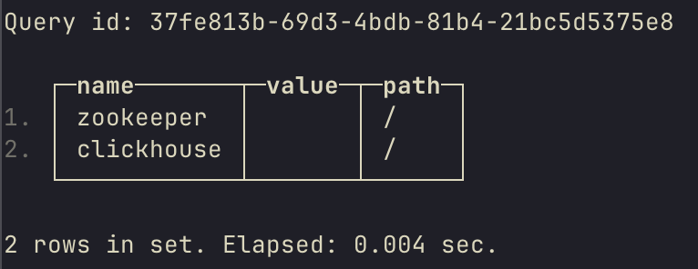


## Часть 2. Практическое упражнение

### Упражнение 1. Запуск и проверка подключения

1. Создать базу данных

``` sql
CREATE DATABASE IF NOT EXISTS hw_4_database;
SHOW DATABASES;
```

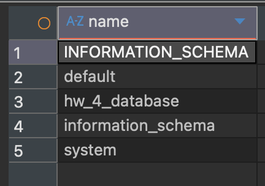

2-3. В созданной базе данных создать таблицу с движком MergeTree

``` sql
CREATE TABLE hw_4_database.test_table (
    int_col UInt32,
    uuid_col UUID,
    dt_col DateTime,
    str_col String
) ENGINE = MergeTree()
ORDER BY int_col;
```

4. Заполнить таблицу тестовыми данными (генерацию данных можно выполнить по примеру, приведенному в приложении 1 или по аналогии)

```
INSERT INTO hw_4_database.test_table
SELECT q.int_val, q.uuid_val, q.dt_val, q.str_val
FROM (
    SELECT modulo(rand(), 999) + 1 AS int_val,
           generateUUIDv4() AS uuid_val,
           now() - interval rand()/1000 second AS dt_val,
           rand() / 500_000 AS int_val_2,
           multiIf(int_val_2 <= 1500, 'A',
                   int_val_2 <= 3000, 'B',
                   int_val_2 <= 4500, 'C',
                   int_val_2 <= 6000, 'D',
                   int_val_2 <= 7300, 'E',
                   'F') AS str_val
    FROM numbers(10_000_000)
) q;
```

```
SELECT count(*)
FROM hw_4_database.test_table;
```


5. Выполнить любой аналитический запрос к созданной таблице, который включает

```
SELECT str_col,
       countDistinct(uuid_col) AS unique_uuids,
       sum(int_col) AS total_int
FROM hw_4_database.test_table
GROUP BY str_col;
```

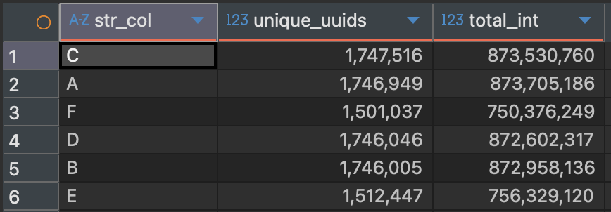

6. Проверить содержимое следующих системных таблиц ClickHouse

```
SELECT * FROM system.clusters;
```


```
SELECT * FROM system.macros;
```

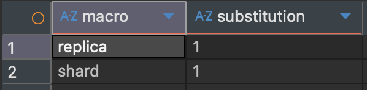

```
SELECT * FROM system.zookeeper WHERE path = '/';
```

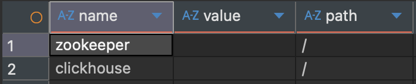

```
SELECT * FROM system.distributed_ddl_queue;
```


```
SELECT * FROM system.replication_queue;
```


7. Проверить работу следующих функций

```
SELECT getMacro('replica');
```


```
SELECT * FROM clusterAllReplicas('default', system.one);
```


8. С использованием системных таблиц проанализировать и зафиксировать следующие метрики:

```
SELECT query, query_duration_ms, memory_usage 
FROM system.query_log 
WHERE type = 'QueryFinish'
ORDER BY event_time DESC
LIMIT 5;
```

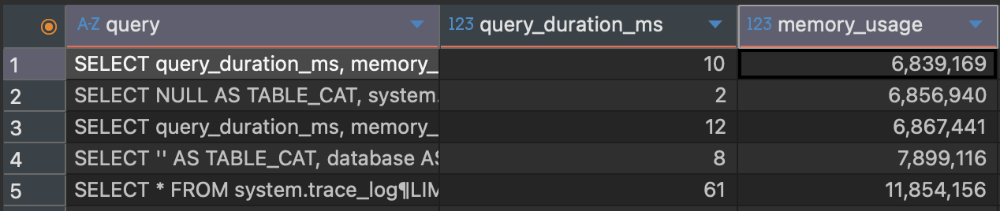

```
SELECT
sum(bytes_on_disk) AS compressed,
sum(data_uncompressed_bytes) AS uncompressed,
sum(primary_key_bytes_in_memory) AS first_index
FROM system.parts
WHERE table = 'test_table';
```

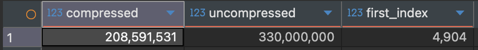

```
SELECT
name,
sum(data_compressed_bytes) AS compressed_col,
sum(data_uncompressed_bytes) AS uncompressed_col
FROM system.columns
WHERE table = 'test_table'
GROUP BY name;
```

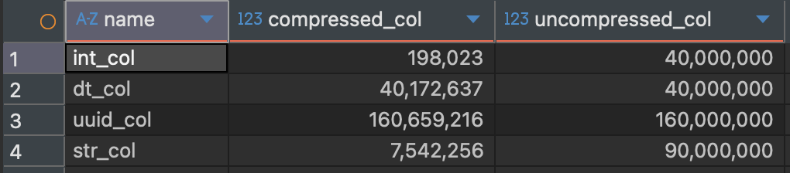

8-10. Создать таблицы

```
CREATE TABLE hw_4_database.merge_small (
    int_col UInt32,
    uuid_col UUID,
    dt_col DateTime,
    str_col String
) ENGINE = MergeTree()
ORDER BY id;

CREATE TABLE hw_4_database.merge_large (
    int_col UInt32,
    uuid_col UUID,
    dt_col DateTime,
    str_col String
) ENGINE = MergeTree()
ORDER BY id;

CREATE TABLE hw_4_database.buffer_large (
    int_col UInt32,
    uuid_col UUID,
    dt_col DateTime,
    str_col String
) ENGINE = Buffer(my_db, merge_large, 16, 10, 100, 10000, 1000000, 10000000, 100000000);
```

11-12. С помощью скрипта запустить одновременную автоматическую вставку записей в обе таблицы

``` bash
./insert.sh
```

13. По завершении процесса вставки (в течение 5–10 минут) проверить итоговое количество записей в обеих целевых таблицах

``` sql
SELECT
    table,
    count() AS parts,
    sum(rows) AS rows
FROM system.parts
WHERE database = 'hw_4_database'
AND table IN ('merge_small', 'merge_large')
AND active
GROUP BY table;
```

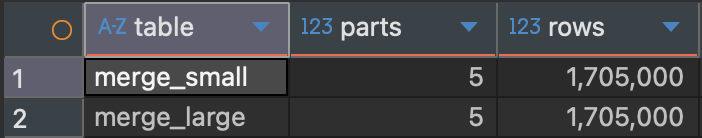

14. Проверить количество активных и неактивных партиций (кусков данных) в целевых таблицах

``` sql
SELECT
    table,
    active,
    count() AS parts_count,
    sum(rows) AS rows_count
FROM system.parts
WHERE database = 'hw_4_database'
AND table IN ('merge_small', 'merge_large')
GROUP BY table, active
ORDER BY table, active DESC;
```

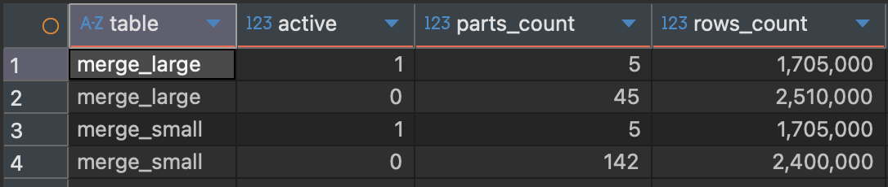

## Упражнение 3. Оптимизация Order by

15. Создать таблицу в соответствии с выданным описанием (см. скрипт в приложении)

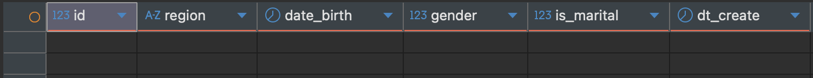

16. Заполнить таблицу сгенерированными данными, используя предоставленный скрипт


17. Выполнить оптимизацию таблицы таким образом, чтобы в результате остался только один кусок (одна партиция)

18. Выполнить указанные запросы (см. приложение) и для каждого запроса

```
SELECT
     table,
     sum(primary_key_bytes_in_memory) AS primary_key
 FROM system.parts
 WHERE database = 'default'
 AND table = 'person_data'
 AND active
 GROUP BY table;
 ```

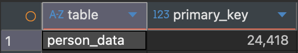

18.1. Запрос 1
  
Результаты выполнения запроса:

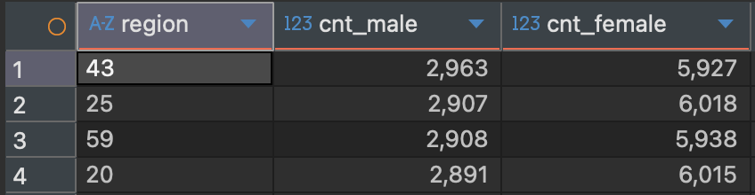

Параметры выполнения запроса:

Среднее время выполнения запроса 16.4 мс

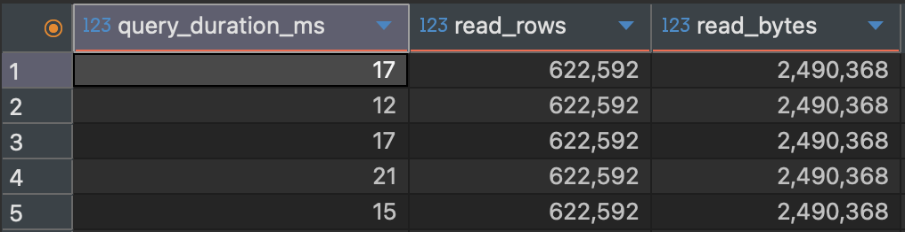

18.2. Запрос 2

Результаты выполнения запроса:


Параметры выполнения запроса:

Среднее время выполнения запроса 234.6 мс

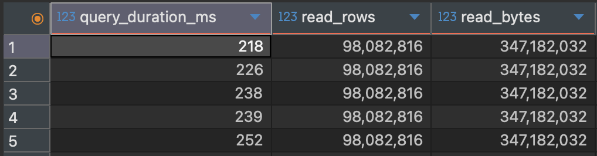

19. Оптимизировать ORDER BY и PRIMARY KEY таблицы так, чтобы

``` sql
CREATE TABLE default.person_data_opt (
id          UInt64,
region      LowCardinality(String),
date_birth  Date,
gender      UInt8,
is_marital  UInt8,
dt_create   DateTime
)
ENGINE = MergeTree()
ORDER BY (region, date_birth);
```

Параметры выполнения запроса A:

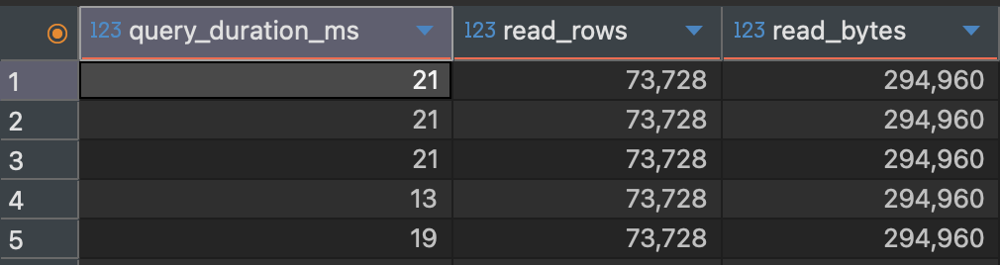

Среднее время выполнения запроса 19 мс

Результаты выполнения запроса B:


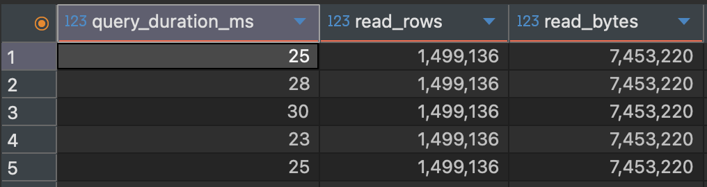

Среднее время выполнения запроса 26.2 мс

20-22. Подбор кодеков

``` sql
CREATE TABLE default.person_data_codec (
    id          UInt64 CODEC(ZSTD(3)),
    region      LowCardinality(String) CODEC(LZ4),
    date_birth  Date CODEC(Delta, LZ4),
    gender UInt8,
	is_marital UInt8,
    dt_create   DateTime CODEC(Delta, LZ4)
)
ENGINE = MergeTree()
ORDER BY (date_birth);

INSERT INTO default.person_data_codec
SELECT *
FROM default.person_data;

OPTIMIZE TABLE default.person_data FINAL;
OPTIMIZE TABLE default.person_data_codec FINAL;
```

В результате достигнуто уменьшение занимаего объема на 24%

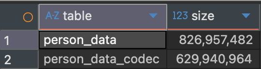

Время выполнения запроса A сократилось с 16.4 мс до 13.2 мс

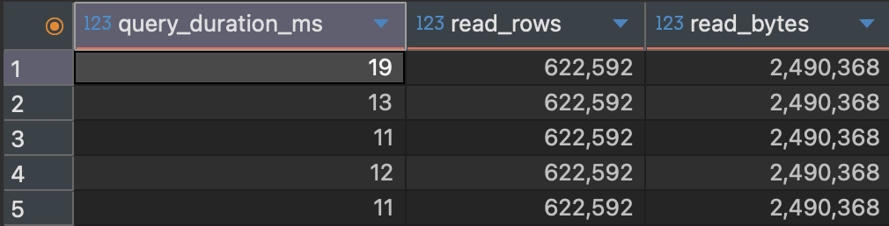

Время выполнения запроса B увеличилось с 234.6 мс до 248 мс (6%)

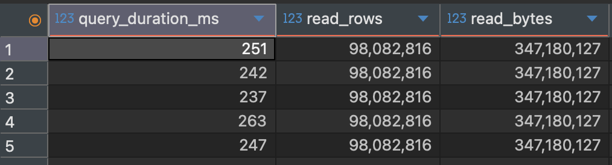
